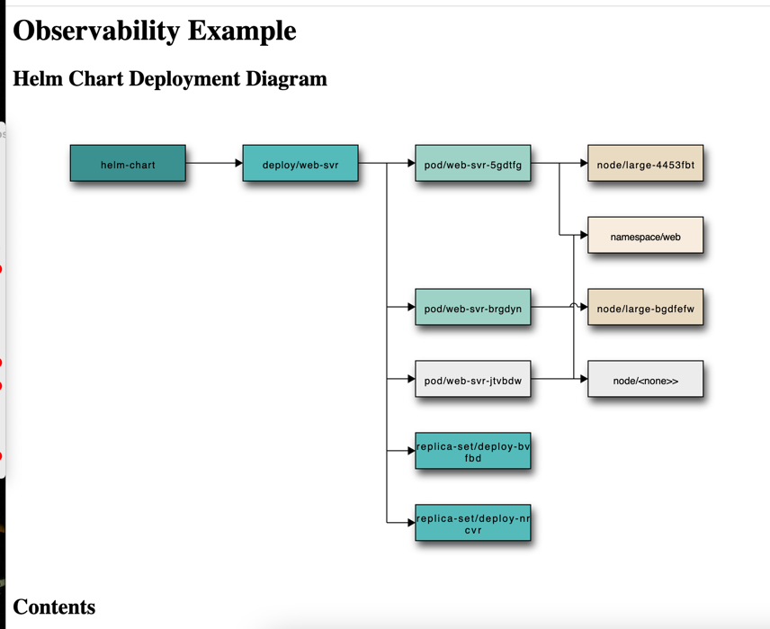

# kroki-srv

A demonstration of how you can make visualising the state of a system much simpler by using automatically-generated diagrams;

It involves running two websites -- one rust axum server that generates the HTML, and a kroki server for the images.

Use `make start` to get going. Requires docker, and exposes `http://localhost:7999` as the main server.